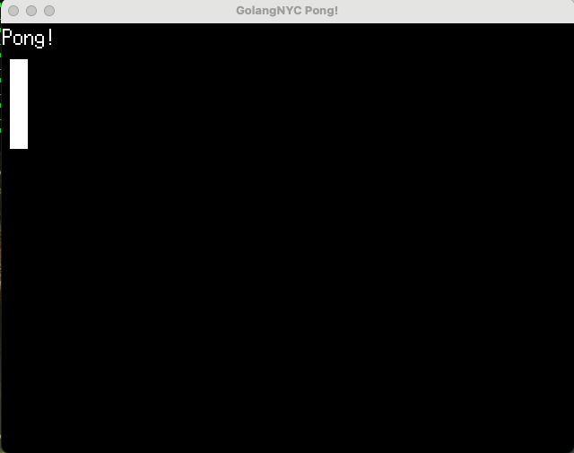
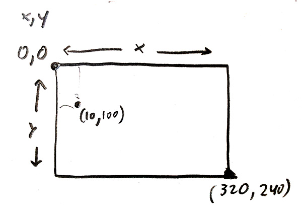
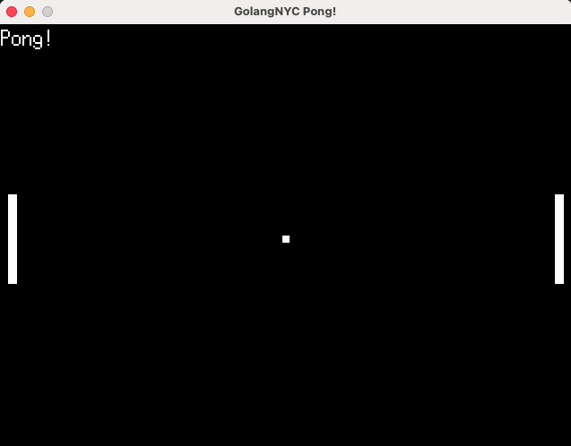

# Code Pong in Go with Ebitengine Tutorial/A live coding talk by Nick Golebiewski.

Pong is the best known early video game! So lets make that with Go using the open source Ebitengine Game Engine developed by Hajime Hoshi. 

Why? Go is primarily known as a backend language, used for DevOps (Development Operations), REST APIs, Cloud Computing, Network Engineering, Site Reliability Engineering etc. out in the real digital world. It is also fast and compiles down to a binary. I am talking to a room of Go Engineers, so I should ask you how you use Go in 'Production' for live sites.

In a game, we have a game loop, that calls an Update (input, update locations, physics, etc.), a Draw function (put everything on the screen) set to 60 times a second in Ebitengine (which can fluctuate), over and over again. 

Fun if you like to code. Easy to start up with too. 

## Step 0

Let's start by making a directory here in our terminal, and move into that folder. Then let's initialize the project

```mkdir pong_tutorial```
```cd pong_tutorial```
```go mod init pong_tutorial```

Let's open up the ebitengine website https://ebitengine.org/en/documents/install.html and follow along, copied over here:

Add main.go with this content:

```go
package main

import (
	"log"

	"github.com/hajimehoshi/ebiten/v2"
	"github.com/hajimehoshi/ebiten/v2/ebitenutil"
)

type Game struct{}

func (g *Game) Update() error {
	return nil
}

func (g *Game) Draw(screen *ebiten.Image) {
	ebitenutil.DebugPrint(screen, "Hello, World!")
}

func (g *Game) Layout(outsideWidth, outsideHeight int) (screenWidth, screenHeight int) {
	return 320, 240
}

func main() {
	ebiten.SetWindowSize(640, 480)
	ebiten.SetWindowTitle("Hello, World!")
	if err := ebiten.RunGame(&Game{}); err != nil {
		log.Fatal(err)
	}
}
```

Run go mod tidy to add dependencies to your go.mod:
```go mod tidy```

Finally, run go run to execute your program.

```go run .```

You will be able to see a window with a message:

>Hello, World!

NEXT, lets just update the "Hello, World" lines to say "Hello GoLang NYC, PONG!"
then it will show up on screen when we run ```go run .``` and as the title of the window.

CTRL-C to close the window from the terminal or click on the close button on the game window.

## Step 1: Draw a rectangle

Let's draw a rectangle on the screen, this is going to be the basis for our player 1 paddle.
I think it is magic when machines start drawing pictures! Just like turtle back in school...

This uses ebiten's vector package.
func vector.FillRect(dst *ebiten.Image, x float32, y float32, width float32, height float32, clr color.Color, antialias bool)
FillRect fills a rectangle with the specified width and color.


```go
func (g *Game) Draw(screen *ebiten.Image) {
	ebitenutil.DebugPrint(screen, "Pong!")
	vector.FillRect(screen, 5, 20, 10, 50, color.White, false)
}
```

First off, we need to pass in the screen.
What are those numbers?
The numbers are the top left (x,y) of the rectangle and the next set of numbers are the width and the height of the rectangle. Coordinates
We add in the color (can take RGB with an alpha (transparancy) too)
The false is for anti-alias. You'd leave it off for pixel art, and turn it on for smoothing out the art, like how most fonts look smooth rather than pixels, unless of course you intentially make it that way. Here it doesn't matter, since we're drawing a rectangle.



On that note, let's talk about the coordinate system:
The top left corner is the origin for the x,y at (0,0).
The bottom right corner is the screen width, screen height. In this case (320,240).
Here's a sketch to show it.



So we are drawing this proto-paddle starting at (5,20) 5 pixel from the left side and 20 down from the top -- and then the function makes it 10 pixel wide and 50 pixels tall. Essentially we are saying, draw a rectangle starting at (5,20) that is 5 pixels wide and 50 pixels tall. In fact, lets turn that into code, as that will be essential for moving our paddle around.

This is where our code stands now:
```go
package main

import (
	"image/color"
	"log"

	"github.com/hajimehoshi/ebiten/v2"
	"github.com/hajimehoshi/ebiten/v2/ebitenutil"
	"github.com/hajimehoshi/ebiten/v2/vector"
)

// we'll just keep our constant variables for game play up here for clarity.
// Best practice would be to add to the Game struct and have a NewGame function return a new game before
// starting the game loop

type Game struct{}

func (g *Game) Update() error {
	return nil
}

func (g *Game) Draw(screen *ebiten.Image) {
	ebitenutil.DebugPrint(screen, "Pong!")
	vector.FillRect(screen, 5, 20, 10, 50, color.White, false)
}

func (g *Game) Layout(outsideWidth, outsideHeight int) (screenWidth, screenHeight int) {
	return 320, 240
}

func main() {
	ebiten.SetWindowSize(640, 480)
	ebiten.SetWindowTitle("GolangNYC Pong!")
	if err := ebiten.RunGame(&Game{}); err != nil {
		log.Fatal(err)
	}
}
```

## Step 2: Move the paddle

In Pong, which way do the paddles move? 

Up and down on the Y axis.

We are interested in changing the Y axis.

Right now we have the rectangle, or should I say, paddle (video game leap of imagination) hard-coded in. Let's update that.
First, lets codify our paddle's width and height.

1. Let's make the screen width and screen height a constant and drop that into the existing Layout function. *We'll just keep our constant variables for game design up at the top of our main.go for clarity. Best practice would be to add to the Game struct and have a NewGame function return a new game before starting the game loop.*

```go
const (
	sW = 320
	sH = 240
)
```

and 

```go
func (g *Game) Layout(outsideWidth, outsideHeight int) (screenWidth, screenHeight int) {
	return sW, sH
}
```

2. Let's make a struct to hold our paddle information. It needs to know the (x,y) coordinates of the paddle and also lets put in the width and height of the paddle, so we can encode, and update that easily if we decide we want a longer or wider paddle.

```go
type Paddle struct {
	x      float32
	y      float32
	width  float32
	height float32
}
```

3. Let's take that first vector.FillRect function call and turn it into a method on the Paddle struct to draw that to the screen. Since we will be reusing it after all to draw paddle 2. We start at the paddle's origin x,y and then do math to get the coordinate in the opposite corner for the paddle's height and width.

```go
func (p Paddle) drawPaddle(screen *ebiten.Image) {
	// vector.FillRect(screen, 5, 20, 10, 50, color.White, false) // was this previously
	vector.FillRect(screen, p.x, p.y, p.x+p.width, p.y+p.height, color.White, false)
}
```

4. Let's make a paddle, and drop that in after the constants. In other game scenarios, you'd probably want to make a NewPaddle() constructor function, but I think this is easier to read and demonstrate.
```var p1 Paddle```

Then let's create the paddle before the game loop starts, lets do a reset/start up all-in-one constructor function meets an Init
function.

```go
// Sort of like a constructor function meets an Init
func reset() {
	// Let's center the Y value, which is half the screen height - half the paddle height!
	p1 = Paddle{5.0, sH/2 - paddleHeight/2, paddleWidth, paddleHeight}
}
```

put that in main before the loop...

```go
func main() {
	ebiten.SetWindowSize(640, 480)
	ebiten.SetWindowTitle("GolangNYC Pong!")
	reset()
	if err := ebiten.RunGame(&Game{}); err != nil {
		log.Fatal(err)
	}
}
```

and add it into the Draw function.

```go
func (g *Game) Draw(screen *ebiten.Image) {
	ebitenutil.DebugPrint(screen, "Pong!")
	p1.drawPaddle(screen)
}
```

Let's add in (and then remove) a quick test to see the paddle moving in the update function! Run it once and watch the paddle slide off the bottom of the screen. Every game frame, or 'tick' in ebitengine, we'll add 1 to the y value.
```go
func (g *Game) Update() error {
	p1.y += 1
	return nil
}
```

Here's all the code


```go
package main

import (
	"image/color"
	"log"

	"github.com/hajimehoshi/ebiten/v2"
	"github.com/hajimehoshi/ebiten/v2/ebitenutil"
	"github.com/hajimehoshi/ebiten/v2/vector"
)

// we'll just keep our constant variables for game play up here for clarity.
// Best practice would be to add to the Game struct and have a NewGame function return a new game before
// starting the game loop

const (
	sW           = 320
	sH           = 240
	paddleWidth  = 5.0
	paddleHeight = 50.0
)

var p1 Paddle

type Game struct{}

type Paddle struct {
	x      float32
	y      float32
	width  float32
	height float32
}

// Sort of like a constructor function meets an Init
func reset() {
	// Let's center the Y value, which is half the screen height - half the paddle height!
	p1 = Paddle{5.0, sH/2 - paddleHeight/2, paddleWidth, paddleHeight}
}

func (p Paddle) drawPaddle(screen *ebiten.Image) {
	// vector.FillRect(screen, 5, 20, 10, 50, color.White, false) // was this previously
	vector.FillRect(screen, p.x, p.y, p.width, p.height, color.White, false)
}

func (g *Game) Update() error {
	p1.y += 1
	return nil
}

func (g *Game) Draw(screen *ebiten.Image) {
	ebitenutil.DebugPrint(screen, "Pong!")
	p1.drawPaddle(screen)
}

func (g *Game) Layout(outsideWidth, outsideHeight int) (screenWidth, screenHeight int) {
	return sW, sH
}

func main() {
	ebiten.SetWindowSize(640, 480)
	ebiten.SetWindowTitle("GolangNYC Pong!")
	reset()
	if err := ebiten.RunGame(&Game{}); err != nil {
		log.Fatal(err)
	}
}
```

## Step 3: Player Input, Have a player move the paddle

By convention for keyboard based video games we have WASD and the arrow keys. So. PLayer 1 up/down is W/S and player 2 will be arrow up and down.

```go
func (g *Game) Update() error {
	//Player 2 up
	if ebiten.IsKeyPressed(ebiten.KeyW) {
		p1.y -= 1
	}
	//Player 2 down
	if ebiten.IsKeyPressed(ebiten.KeyS) {
		p1.y += 1
	}
	return nil
}
```

Trying that out we see the paddle move! But ugh, is it ever slow. and it moves off the screen! Let's fix those two things.

SLOW: This can be a game variable. Let's make a constant called **speed** but in the future, we might want this in the paddle directly, if we want the paddle to change speed throughout the game, like it ramps up as the ball gets faster, or there are powerups, etc.

```go
const (
	sW           = 320
	sH           = 240
	paddleWidth  = 5.0
	paddleHeight = 50.0
	speed        = 4.0 // NEW
)
```

Which gives us this:

```go
func (g *Game) Update() error {
	//Player 1 up
	if ebiten.IsKeyPressed(ebiten.KeyW) {
		p1.y -= speed
	}
	//Player 1 down
	if ebiten.IsKeyPressed(ebiten.KeyS) {
		p1.y += speed
	}
	return nil
}
```

And, we don't want the paddle to go off screen, so lets clamp it to the top and bottom of the screen's y.

Voila

```go
func (g *Game) Update() error {
	//Player 1 up
	if ebiten.IsKeyPressed(ebiten.KeyW) {
		p1.y = max(p1.y-speed, 0) //clamps to top of screen
	}
	//Player 1 down
	if ebiten.IsKeyPressed(ebiten.KeyS) {
		p1.y = min(p1.y+speed, sH-p1.height) // clamps to bottom of screen, taking the paddleHeight into account since the x,y is the TOP/left corner.
	}
	return nil
}
```

And, all of our code at this state.

```go
package main

import (
	"image/color"
	"log"

	"github.com/hajimehoshi/ebiten/v2"
	"github.com/hajimehoshi/ebiten/v2/ebitenutil"
	"github.com/hajimehoshi/ebiten/v2/vector"
)

// we'll just keep our constant variables for game play up here for clarity.
// Best practice would be to add to the Game struct and have a NewGame function return a new game before
// starting the game loop

const (
	sW           = 320
	sH           = 240
	paddleWidth  = 5.0
	paddleHeight = 50.0
	speed        = 4.0
)

var p1 Paddle

type Game struct{}

type Paddle struct {
	x      float32
	y      float32
	width  float32
	height float32
}

// Sort of like a constructor function meets an Init
func reset() {
	// Let's center the Y value, which is half the screen height - half the paddle height!
	p1 = Paddle{5.0, sH/2 - paddleHeight/2, paddleWidth, paddleHeight}
}

func (p Paddle) drawPaddle(screen *ebiten.Image) {
	// vector.FillRect(screen, 5, 20, 10, 50, color.White, false) // was this previously
	vector.FillRect(screen, p.x, p.y, p.width, p.height, color.White, false)
}

func (g *Game) Update() error {
	//Player 1 up
	if ebiten.IsKeyPressed(ebiten.KeyW) {
		p1.y = max(p1.y-speed, 0) //clamps to top of screen
	}
	//Player 1 down
	if ebiten.IsKeyPressed(ebiten.KeyS) {
		p1.y = min(p1.y+speed, sH-p1.height) // clamps to bottom of screen, taking the paddleHeight into account since the x,y is the TOP/left corner.
	}
	return nil
}

func (g *Game) Draw(screen *ebiten.Image) {
	ebitenutil.DebugPrint(screen, "Pong!")
	p1.drawPaddle(screen)
}

func (g *Game) Layout(outsideWidth, outsideHeight int) (screenWidth, screenHeight int) {
	return sW, sH
}

func main() {
	ebiten.SetWindowSize(640, 480)
	ebiten.SetWindowTitle("GolangNYC Pong!")
	reset()
	if err := ebiten.RunGame(&Game{}); err != nil {
		log.Fatal(err)
	}
}
```

## Step 4: Add Player 2

Basically, we're just copying over player 1, be sure to adjust the x value to account for the fact that the rectangle draws from the top left coordinate and from the far side of the screen. Here's what our file looks like now.

Also, let's take the inputs out and drop it into a new HandleInput function. We can also add other things here in the future, like SPACE or ENTER to serve the ball, F for fullsreen, R to Reset, that kind of stuff.

```go
package main

import (
	"image/color"
	"log"

	"github.com/hajimehoshi/ebiten/v2"
	"github.com/hajimehoshi/ebiten/v2/ebitenutil"
	"github.com/hajimehoshi/ebiten/v2/vector"
)

// we'll just keep our constant variables for game play up here for clarity.
// Best practice would be to add to the Game struct and have a NewGame function return a new game before
// starting the game loop

const (
	sW           = 320
	sH           = 240
	paddleWidth  = 5.0
	paddleHeight = 50.0
	speed        = 4.0
)

var p1 Paddle
var p2 Paddle

type Game struct{}

type Paddle struct {
	x      float32
	y      float32
	width  float32
	height float32
}

// Sort of like a constructor function meets an Init
func reset() {
	// Let's center the Y value, which is half the screen height - half the paddle height!
	p1 = Paddle{5.0, sH/2 - paddleHeight/2, paddleWidth, paddleHeight}
	p2 = Paddle{sW - 5.0 - paddleWidth, sH/2 - paddleHeight/2, paddleWidth, paddleHeight}
}

func (p Paddle) drawPaddle(screen *ebiten.Image) {
	// vector.FillRect(screen, 5, 20, 10, 50, color.White, false) // was this previously
	vector.FillRect(screen, p.x, p.y, p.width, p.height, color.White, false)
}

func handleInput() {
	//Player 1 up
	if ebiten.IsKeyPressed(ebiten.KeyW) {
		p1.y = max(p1.y-speed, 0) //clamps to top of screen
	}
	//Player 1 down
	if ebiten.IsKeyPressed(ebiten.KeyS) {
		p1.y = min(p1.y+speed, sH-p1.height) // clamps to bottom of screen, taking the paddleHeight into account since the x,y is the TOP/left corner.
	}

	//Player 2 up
	if ebiten.IsKeyPressed(ebiten.KeyArrowUp) {
		p2.y = max(p2.y-speed, 0) //clamps to top of screen
	}
	//Player 2 down
	if ebiten.IsKeyPressed(ebiten.KeyArrowDown) {
		p2.y = min(p2.y+speed, sH-p2.height) // clamps to bottom of screen, taking the paddleHeight into account since the x,y is the TOP/left corner.
	}
}

func (g *Game) Update() error {
	handleInput()
	return nil
}

func (g *Game) Draw(screen *ebiten.Image) {
	ebitenutil.DebugPrint(screen, "Pong!")
	p1.drawPaddle(screen)
	p2.drawPaddle(screen)
}

func (g *Game) Layout(outsideWidth, outsideHeight int) (screenWidth, screenHeight int) {
	return sW, sH
}

func main() {
	ebiten.SetWindowSize(640, 480)
	ebiten.SetWindowTitle("GolangNYC Pong!")
	reset()
	if err := ebiten.RunGame(&Game{}); err != nil {
		log.Fatal(err)
	}
}
```

## Step 5: Make it Fullscreen

Quick! Just add this in to the handleInput() function and you're all set. Note how this uses IsKeyJustPressed. Otherwise, pressing 'F' would pick up multiple taps, and would toggle a whole bunch of times. Note that IsKeyJustPressed uses a new to us package within ebiten, the inputil.

```go
// Fullscreen on/off -- easy!
	if inpututil.IsKeyJustPressed(ebiten.KeyF) {
		ebiten.SetFullscreen(!ebiten.IsFullscreen())
	}
```

No need to show all the code here. That was an easy step.

## Step 6: Have a ball



Good news, we're basically just making a really tiny paddle. Maybe you will want to replace the ball with the Go Gopher later on, it is up to you, in that case you would make it an *ebiten.image, but lets just make this a little square.

Where the ball expands upon the paddle, is that it will hold velocity (we want the ball to get faster on each hit during a volley) and not only do we need to track the ball's x,y coordinates, we need to track the delta X and the delta Y --> how fast the ball is changing in each direction. That is a way EASIER way to approach it than tracking radians and doing heavier math calculations. This is Pong, it was first ~~published~~ manufactured and released in arcades by Atari on November 29, 1972
source: https://en.wikipedia.org/wiki/Pong

Let's add in a ball struct and start it out at the center of the screen, note that we will create the ball in our reset function as well. As it follows along so closely to what we did for the paddles, I'll just share all the code. As of Step 5, I am pushing each step as a commit in GitHub, so you could track it all by looking at the commits. 

All the code:
```go
package main

import (
	"image/color"
	"log"

	"github.com/hajimehoshi/ebiten/v2"
	"github.com/hajimehoshi/ebiten/v2/ebitenutil"
	"github.com/hajimehoshi/ebiten/v2/inpututil"
	"github.com/hajimehoshi/ebiten/v2/vector"
)

// we'll just keep our constant variables for game play up here for clarity.
// Best practice would be to add to the Game struct and have a NewGame function return a new game before
// starting the game loop

const (
	sW           = 320
	sH           = 240
	paddleWidth  = 5.0
	paddleHeight = 50.0
	speed        = 4.0
	ballWidth    = 4.0
)

var p1 Paddle
var p2 Paddle
var b Ball

type Game struct{}

type Paddle struct {
	x      float32
	y      float32
	width  float32
	height float32
}
type Ball struct {
	x     float32
	y     float32
	width float32 // It is a square, width = length
	dx    float32 // delta x
	dy    float32 // delta y
	v     float32 // velocity
}

// Sets the initial values for the player and ball entities
func reset() {
	// Let's center the Y value, which is half the screen height - half the paddle height!
	p1 = Paddle{5.0, sH/2 - paddleHeight/2, paddleWidth, paddleHeight}
	p2 = Paddle{sW - 5.0 - paddleWidth, sH/2 - paddleHeight/2, paddleWidth, paddleHeight}
	b = Ball{sW/2 - ballWidth/2, sH/2 - ballWidth/2, ballWidth, 0, 0, 1}
}

func (p Paddle) drawPaddle(screen *ebiten.Image) {
	// vector.FillRect(screen, 5, 20, 10, 50, color.White, false) // was this previously
	vector.FillRect(screen, p.x, p.y, p.width, p.height, color.White, false)
}

func (b Ball) drawBall(screen *ebiten.Image) {
	vector.FillRect(screen, b.x, b.y, b.width, b.width, color.White, false)
}
func handleInput() {
	// PLAYER CONTROLS

	//Player 1 up
	if ebiten.IsKeyPressed(ebiten.KeyW) {
		p1.y = max(p1.y-speed, 0) //clamps to top of screen
	}
	//Player 1 down
	if ebiten.IsKeyPressed(ebiten.KeyS) {
		p1.y = min(p1.y+speed, sH-p1.height) // clamps to bottom of screen, taking the paddleHeight into account since the x,y is the TOP/left corner.
	}

	//Player 2 up
	if ebiten.IsKeyPressed(ebiten.KeyArrowUp) {
		p2.y = max(p2.y-speed, 0) //clamps to top of screen
	}
	//Player 2 down
	if ebiten.IsKeyPressed(ebiten.KeyArrowDown) {
		p2.y = min(p2.y+speed, sH-p2.height) // clamps to bottom of screen, taking the paddleHeight into account since the x,y is the TOP/left corner.
	}

	// GAME OPTIONS
	// Fullscreen on/off -- easy!
	if inpututil.IsKeyJustPressed(ebiten.KeyF) {
		ebiten.SetFullscreen(!ebiten.IsFullscreen())
	}
}

func (g *Game) Update() error {
	handleInput()
	return nil
}

func (g *Game) Draw(screen *ebiten.Image) {
	ebitenutil.DebugPrint(screen, "Pong!")
	p1.drawPaddle(screen)
	p2.drawPaddle(screen)
	b.drawBall(screen)
}

func (g *Game) Layout(outsideWidth, outsideHeight int) (screenWidth, screenHeight int) {
	return sW, sH
}

func main() {
	ebiten.SetWindowSize(640, 480)
	ebiten.SetWindowTitle("GolangNYC Pong!")
	reset()
	if err := ebiten.RunGame(&Game{}); err != nil {
		log.Fatal(err)
	}
}


```

## Step 7: Move the ball, Serve and...it continues off screen

Ok, let's make the ball move! It starts out static, and when we click/hit space or press ENTER. lets start it moving. This will go into the key update.

In the Ball struct lets add a flag to check if the ball is sitting in the center ready to be played or is in play
```isInPlay bool    // false is the ready to serve the ball state. true is the ball is in play```

Oops, lets change dx to vx for velocity in the ball struct, and drop in any missing pointers in the methods.

In the handle input function, lets listen for a button that will serve the ball if it is not in play.
We check to see if the ball is ready to serve and if so, launch it with our new serveBall function

```go

package main

import (
	"image/color"
	"log"
	"math/rand/v2"

	"github.com/hajimehoshi/ebiten/v2"
	"github.com/hajimehoshi/ebiten/v2/ebitenutil"
	"github.com/hajimehoshi/ebiten/v2/inpututil"
	"github.com/hajimehoshi/ebiten/v2/vector"
)

// we'll just keep our constant variables for game play up here for clarity.
// Best practice would be to add to the Game struct and have a NewGame function return a new game before
// starting the game loop

const (
	sW           = 320
	sH           = 240
	paddleWidth  = 5.0
	paddleHeight = 50.0
	speed        = 4.0
	ballWidth    = 4.0
)

var p1 Paddle
var p2 Paddle
var b Ball

type Game struct{}

type Paddle struct {
	x      float32
	y      float32
	width  float32
	height float32
}
type Ball struct {
	x        float32
	y        float32
	width    float32 // It is a square, width = length
	vx       float32 // velocity x
	vy       float32 // velocity y
	v        float32 // velocity
	isInPlay bool    // false is the ready to serve the ball state. true is the ball is in play
}

// Sets the initial values for the player and ball entities.
// In a game with more than three entities you'd make a constructor function that would help you drop in all the defaults, etc.
func reset() {
	// Let's center the Y value, which is half the screen height - half the paddle height!
	p1 = Paddle{5.0, sH/2 - paddleHeight/2, paddleWidth, paddleHeight}
	p2 = Paddle{sW - 5.0 - paddleWidth, sH/2 - paddleHeight/2, paddleWidth, paddleHeight}
	b = Ball{sW/2 - ballWidth/2, sH/2 - ballWidth/2, ballWidth, 0, 0, 1, false}
}

func (p *Paddle) drawPaddle(screen *ebiten.Image) {
	// vector.FillRect(screen, 5, 20, 10, 50, color.White, false) // was this previously
	vector.FillRect(screen, p.x, p.y, p.width, p.height, color.White, false)
}

func (b *Ball) drawBall(screen *ebiten.Image) {
	vector.FillRect(screen, b.x, b.y, b.width, b.width, color.White, false)
}

// Emulates a coinflip and used to switch between + and - numbers in practice
func coinFlip() float32 {
	if rand.Float64() > .5 {
		return 1.0
	}
	return -1.0
}

// gives initial direction on serve
func (b *Ball) serveBall() {
	b.isInPlay = true //be explicit, rather than !b.isInPlay
	//set initial dx to dy
	b.vx = coinFlip()                      // uses a helper function to either start the ball going left or right, -1 or 1
	b.vy = rand.Float32() * 3 * coinFlip() // how diagonal will it be?
}

func (b *Ball) updateBall() {
	b.x = b.x + (b.v * b.vx)
}

func handleInput() {
	// PLAYER CONTROLS

	//Player 1 up
	if ebiten.IsKeyPressed(ebiten.KeyW) {
		p1.y = max(p1.y-speed, 0) //clamps to top of screen
	}
	//Player 1 down
	if ebiten.IsKeyPressed(ebiten.KeyS) {
		p1.y = min(p1.y+speed, sH-p1.height) // clamps to bottom of screen, taking the paddleHeight into account since the x,y is the TOP/left corner.
	}

	//Player 2 up
	if ebiten.IsKeyPressed(ebiten.KeyArrowUp) {
		p2.y = max(p2.y-speed, 0) //clamps to top of screen
	}
	//Player 2 down
	if ebiten.IsKeyPressed(ebiten.KeyArrowDown) {
		p2.y = min(p2.y+speed, sH-p2.height) // clamps to bottom of screen, taking the paddleHeight into account since the x,y is the TOP/left corner.
	}

	//Ball Start
	if b.isInPlay == false && (ebiten.IsKeyPressed(ebiten.KeySpace) || ebiten.IsKeyPressed(ebiten.KeyEnter) || ebiten.IsMouseButtonPressed(ebiten.MouseButton0)) {
		b.serveBall()
	}

	// GAME OPTIONS
	// Fullscreen on/off -- easy!
	if inpututil.IsKeyJustPressed(ebiten.KeyF) {
		ebiten.SetFullscreen(!ebiten.IsFullscreen())
	}
}

func (g *Game) Update() error {
	handleInput()
	b.updateBall()
	return nil
}

func (g *Game) Draw(screen *ebiten.Image) {
	ebitenutil.DebugPrint(screen, "Pong!")
	p1.drawPaddle(screen)
	p2.drawPaddle(screen)
	b.drawBall(screen)
}

func (g *Game) Layout(outsideWidth, outsideHeight int) (screenWidth, screenHeight int) {
	return sW, sH
}

func main() {
	ebiten.SetWindowSize(640, 480)
	ebiten.SetWindowTitle("GolangNYC Pong!")
	reset()
	if err := ebiten.RunGame(&Game{}); err != nil {
		log.Fatal(err)
	}
}

```


## Step 8: THE GAME! Bounce ball off paddles, deflect of screen top and bottom, score points when passes left or right edge of screen. 

This step is a lot in one step, but they are all kind of bundled together. Mostly in update

1. First, lets make a player struct to hold the score

```go
type Player struct {
	score int
}
```


2. lets set up a var for Player1 and Player 2 and a resetPlayers() function that mirrors the reset() one. Basically, we will be reseting the paddle and ball positions WAY more often then reseting the score. If it was combined we'd always be setting the score back to 0

```go
func resetPlayers() {
	player1 = Player{0}
	player2 = Player{0}
}
```

and in main()

```go
func main() {
	ebiten.SetWindowSize(640, 480)
	ebiten.SetWindowTitle("GolangNYC Pong!")
	reset()
	resetPlayers()
	if err := ebiten.RunGame(&Game{}); err != nil {
		log.Fatal(err)
	}
}
```

we'll print the scores to the console for now with a fmt print statement in the next step.

3. AABB collision checking!
Box [A] overlaps Box [B] only if:
- A’s left < B’s right
- A’s right > B’s left
- A’s top < B’s bottom
- A’s bottom > B’s top

        ┌────────────┐
        │            │
        │   ┌───┐    │
        │   │ A │    │
        │   └───┘    │
        │          B │
        └────────────┘

```go
// a classic Axis Aligned Bounding Box Collission check
func aabb(ax, ay, aw, ah, bx, by, bw, bh float32) bool {
	return ax < bx+bw &&
		ax+aw > bx &&
		ay < by+bh &&
		ay+ah > by
}

func (b *Ball) updateBall() {
	//check for top/bottom screen hits to bounce.
	//top || bottom
	if b.y <= 0 || b.y >= sH-b.width {
		b.vy = -b.vy
	}
	//check left -> if off screen player 2 scores a point and reset the ball and paddles to centered positions
	if b.x <= 0 {
		player2.score += 1
		reset()
		fmt.Println("Player 1: ", player1.score, "Player 2: ", player2.score)
	}
	//check right
	if b.x >= sW {
		player1.score += 1
		reset()
		fmt.Println("Player 1: ", player1.score, "Player 2: ", player2.score)
	}
	//check for paddle collision. Ball shouldn't know about Paddle, but this is a small game, so no point to abstract.
	//Paddle 1
	if aabb(b.x, b.y, b.width, b.width, p1.x, p1.y, p1.width, p1.height) && b.vx < 0 {
		b.vx = -b.vx
		b.vy += rand.Float32() / 3 * coinFlip()
		b.v = min(maxSpeed, b.v+.5)
	}

	//Paddle 2
	if aabb(b.x, b.y, b.width, b.width, p2.x, p2.y, p2.width, p2.height) && b.vx > 0 {
		b.vx = -b.vx
		b.vy += rand.Float32() / 3 * coinFlip()
		b.v = min(maxSpeed, b.v+.5)
	}

	//at last, move the ball!
	b.x = b.x + (b.v * b.vx)
	b.y = b.y + (b.v * b.vy)
}
```